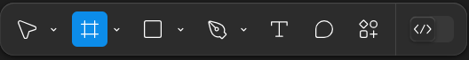
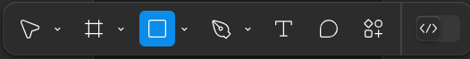
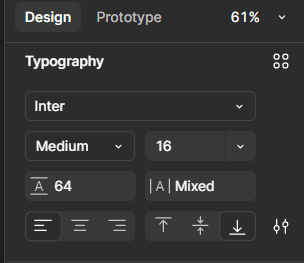
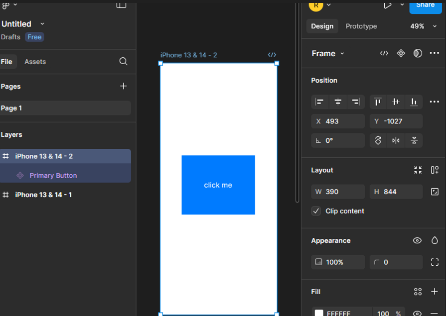
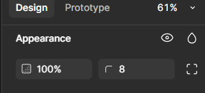
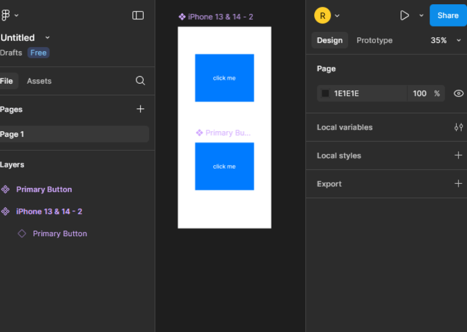

## Overview
Components in **Figma** are reusable design elements (like buttons or icons) that save time and keep your project consistent. This section will walk you through creating a component, editing it, and using it across your design. By the end, you’ll have a reusable button component ready to streamline your workflow.

## Steps to Create and Use Components

1. **Open** Figma in your browser or desktop app, log into your account, and open a Design file.
2. **Create** a new frame by selecting the **Frame Tool (F)** from the toolbar, then clicking and dragging on the canvas. Set the size to a preset like *iPhone 13* (in the right-hand properties panel) or use custom dimensions (e.g., 375x812px).  
   
3. **Draw** a button shape using the **Rectangle Tool (R)**. Click on the canvas and drag to create a rectangle (e.g., 200x50px). In the properties panel, set the Fill color to a hex value like `#007BFF` (a nice blue).  
   
4. **Add** text to your button with the **Text Tool (T)**. Click inside the rectangle, type “Click Me,” and adjust the font size to 16px and weight to bold in the properties panel.  
   
5. **Select** both the rectangle and text by holding `Shift` and clicking each element, or dragging a selection box around them.
6. **Convert** these elements into a component by right-clicking the selection and choosing **Create Component**, or pressing `Cmd + Alt + K` (Mac) or `Ctrl + Alt + K` (Windows). The selection will turn blue, indicating it’s now a component.
    
>!!! success "Success"  
       Your button component is ready! It’s now reusable across your project.

7. **Name** your component in the Layers panel (on the left). Right-click the component (labeled something like Component_1), select Rename, and type “Primary Button.”
8. **Edit** the master component to refine it. Double-click the component, then adjust the corner radius to 8px (in the properties panel) or change the text to “Submit.” These changes will apply everywhere the component is used.  
     
>!!! warning "Warning"  
       *Don’t edit an instance’s core structure (e.g., deleting the rectangle) unless you detach it first by right-clicking and selecting Detach Instance. This avoids breaking the link to the master component.*

9. **Use** an instance of the component by dragging it from the Assets panel (left sidebar) onto your canvas. Place it below the original to test it out.
    
10. **Update** the master component again—select it, change the Fill color to `#0056B3` (a darker blue), and watch the instance update automatically.  
>!!! info "Info"  
    *Shortcut Tip: Press `Alt` (Windows) or `Option` (Mac) while dragging an instance to duplicate it quickly.*

## Conclusion
You’ve now created and mastered a reusable **Primary Button** component! It’s stored in your Assets panel, ready to keep your designs consistent and efficient. Components are like building blocks—use them to speed up your workflow. Next, let’s put this component to work by creating a design layout in Figma!