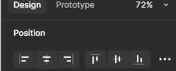

## Overview
Components in **Figma** are reusable design elements (like buttons or icons) that help save time and ensure consistency across your project. In this guide, you’ll learn how to create, edit, and use components effectively. By the end, you’ll have a reusable Primary Button component that enhances your workflow.

## Steps to Create and Use Components

1. **Open** Figma in your browser or desktop app and log into your account.
* **Create** a new file by click on **New File (F)** from the Figma dashboard to create a new design project, or open an existing file if you already have one.
* **Set Up** the canvas, on the new file, set up your canvas by adjusting the dimensions. You can do this by selecting the **Frame Tool (F)** and clicking and dragging to create a frame or artboard.
* **Choose** a present layout. Figma provides device-specific artboard presets. Click on the **Frame Tool (T)**and select a device like **iPhone 13** from the preset options, or set custom dimensions in the properties panel.
* **Draw** basic shapes Use basic shapes like **Rectangles (R)**, **Circles (O)**, and **Lines (L)** to lay out components such as buttons, icons, and text boxes on your canvas.
* **Add** text. Select the **Text Tool (T)**, click on the canvas, and type text. Adjust font size, weight, and style from the properties panel on the right.
* **Align** elements. Select multiple elements and use the **Align Tools** in the top bar to align them vertically or horizontally, or use the smart guides that appear when moving elements.

* **Apply** colors. Select a shape or text, then in the right-hand panel, click on the **Fill** color option and pick a color from the color picker or input a specific hex value.
* **Use** auto layout. Select a frame, and then click **Shift + A** to apply **Auto Layout**. This helps to automatically adjust and position elements within a frame (e.g., buttons and text will auto-adjust as their size changes).
* **Group** elements. Select multiple elements and press **Ctrl + G** (or **Cmd + G** on macOS) to group them. This helps in organizing your design and allows you to move related elements as one unit.
* **Preview** your layout. To preview the design, press **Present** in the top-right corner. This allows you to view the design in presentation mode and check how the elements look in the frame.
* **Save and share** Once satisfied with your layout, save the file, and share it by clicking the **Share** button in the top-right corner to generate a shareable link.

!!! info "Info"
    *Shortcut Tip: Press `Alt` (Windows) or `Option` (Mac) while dragging an instance to duplicate it quickly.*

!!! warning "Warning"
    *Don’t edit an instance’s core structure (e.g., deleting the rectangle) unless you detach it first by right-clicking and selecting Detach Instance. This avoids breaking the link to the master component.* 

## Conclusion

Success! You've successfully **design a layout** in Figma using components and design elements. By following these steps, you've laid the foundation for building a consistent and organized design. Whether you're designing an app, a website, or any other interface, understanding how to create and structure layouts efficiently will speed up your workflow and ensure your designs are both functional and visually appealing.

!!! success "Success"
    Your layout is now ready! With your components, text, and alignment in place, you can easily reuse these elements across your design. Celebrate by exploring new design possibilities, experimenting with different variations, or adding more complex interactions and elements. Keep building and refining to perfect your design!