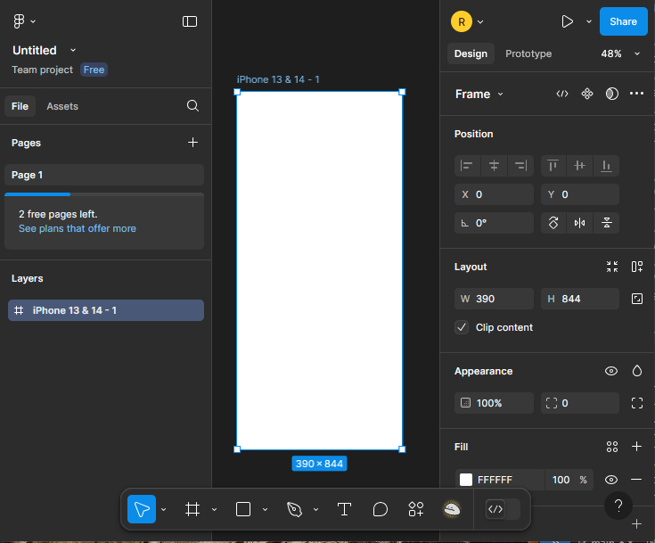
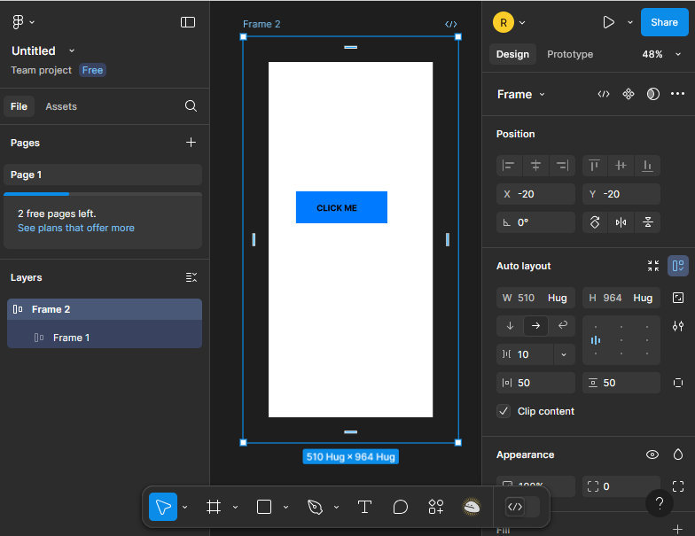
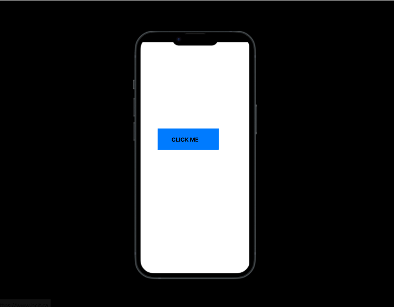

## Overview
Design layouts in **Figma** use components, shapes, and text to create organized, reusable interfaces. This guide walks you through building a layout step-by-step, leveraging tools like Auto Layout for flexibility and consistency.

## Steps to Create a Design Layout

1. **Open** Figma in your browser or desktop app and log into your account.
2. **Start** a new file by clicking **New File** on the Figma dashboard, or open an existing one.
3. **Set Up** your canvas with the **Frame Tool (F)**. Click and drag to create a frame, then pick a preset like **iPhone 13** (375x812px) from the properties panel on the right, or set custom dimensions.
    
4. **Draw** shapes for your layout (e.g., a button) using the **Rectangle Tool (R)**, **Ellipse Tool (O)**, or **Line Tool (L)**. Try a 200x50px rectangle for a button.
5. **Add** text with the **Text Tool (T)**. Click inside your shape, type “Click Me,” and set the font to 16px bold in the properties panel.
6. **Align** elements by selecting them (hold `Shift`) and using the **Align Tools** in the toolbar (top) to center them. Smart guides will assist as you drag.  
   
7. **Color** your shapes or text. Select an element, click **Fill** in the properties panel, and choose a color (e.g., `#007BFF` for blue) via the picker or hex code.  
>!!! success "Success"  
    Your layout’s foundation is set! Shapes, text, and colors are now in place.
8. **Apply** Auto Layout for flexibility. Select a frame or group (e.g., your button and text), press **Shift + A**, and adjust padding (e.g., 10px) and spacing in the properties panel. Auto Layout makes elements resize automatically with content changes—like a button stretching for longer text.
    
>!!! info "Info"  
    *Duplicate quickly: Hold `Alt` (Windows) or `Option` (Mac) while dragging.*
9. **Group** related elements by selecting them and pressing **Ctrl + G** (Windows) or **Cmd + G** (Mac) to keep your design tidy.  
>!!! warning "Warning"  
    *Avoid editing a component instance’s core structure (e.g., deleting a shape) without detaching it first. Right-click and select Detach Instance to prevent breaking the master component.*
10. **Preview** your layout by clicking the play button (▶) labeled **Present** in the top-right corner to view it in presentation mode.
11. **Save and Share** your file. Save your work, then click **Share** (top-right) for a link.  
    
>!!! warning "Component Overuse Warning"  
    *Too many unorganized components can clutter your project. Use a design system to stay efficient.*

## Conclusion
You’ve crafted a sleek design layout in Figma! With shapes, text, and Auto Layout, your design is both functional and adaptable. Next, add interactivity by exploring the prototyping section!