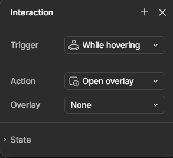

## Overview
In **Figma**, prototyping allows you to create interactive, clickable versions of your designs. This helps you visualize and test how users will navigate through your app, website, or other digital products. By linking frames, adding interactions, and incorporating animations, you can simulate real-world usage and gather valuable feedback before development. In this guide, you’ll learn how to create a prototype, set interactions, and preview your designs in action. By the end, you'll have a fully interactive prototype that you can share and test with others, bringing your designs to life!

## Steps to Create and Use Components

1. **Open** Figma in your browser or desktop app and log into your account.
* **Select** the prototype tab. In the top-right corner, switch from **Design** to **Prototype** to start linking frames and creating interactions.
* **Link** two frames. Select a UI element (like a button), then click the **Prototype Node** (the small circular dot) that appears on the right side of the element. Drag it to the destination frame or screen.
* **Set** interaction type. In the properties panel on the right, choose the interaction type (e.g., **On Click**, **On Hover**, **After Delay**).
* **Configure** animation. Set an animation for the transition, such as **Smart Animate**, **Instant**, or **Move In/Out**. Adjust the duration and easing options to create smooth transitions.
* **Add** more interacts. Link other elements, such as buttons or images, to other frames, creating a flow between your screens. Repeat the process for all interactive elements in your design.
* **Preview** the prototype. Press the **Present** button in the top-right corner to see your interactive prototype. Click on elements to test the interactions and transitions.
* **Test** on device. Share your prototype link with someone or view it on a mobile device by scanning the **QR Code** that appears in the prototype preview mode.
* **Adjust** prototyping flow. If needed, go back to the prototype tab and refine the interactions. You can adjust the links, animations, or add delays between interactions.
* **Add** overlays. For modals or pop-up screens, use **Overlays**. In the properties panel, select **Overlay** instead of a regular transition. You can also choose to center the overlay or adjust its position relative to the screen.

* **Create** interactive components. If you need interactive elements like dropdowns, toggle switches, or checkboxes, you can create interactive components by combining frames with interactions.
* **Share** Once you’re satisfied, share your prototype by clicking on the **Share** button in the top-right corner and copying the link or generating a QR code for mobile testing.

!!! info "Info"
    *Shortcut Tip: Press `Alt` (Windows) or `Option` (Mac) while dragging an instance to duplicate it quickly.*

!!! info "Info"
    *Collaboration Tip: If working in a team, ensure proper naming conventions for frames and components to keep your prototype organized and easy to navigate.*

!!! warning "Warning"
    *Be cautious when modifying component instances. Editing an instance’s core structure (e.g., deleting a rectangle) without detaching it first can break the link to the master component. To avoid issues, right-click and select Detach Instance before making significant changes*

!!! warning "Animation Performance Warning"
    *Excessive animations, especially heavy Smart Animates, can cause lag in larger prototypes. Keep animations minimal and test performance on multiple devices.*

## Conclusion

Success! You've successfully created an **interactive prototype** in Figma, linking your frames and adding animations and interactions. This will help bring your designs to life and allow you to communicate user flows, transitions, and interactions with others. By following these steps, you’ve gained the ability to prototype complex user interfaces, test interactions, and fine-tune your design. Prototyping in Figma is an essential step in creating interactive, dynamic experiences—whether for apps, websites, or other digital products.

!!! success "Success"
    Your prototype is now ready! With interactions, animations, and transitions in place, you can easily test and iterate on your design. Celebrate by sharing your prototype with stakeholders or testing it on a device. Keep refining and enhancing your prototype by adding new elements, adjusting flows, or experimenting with more advanced interactions. Continue building and perfecting your design to create a polished, interactive experience!